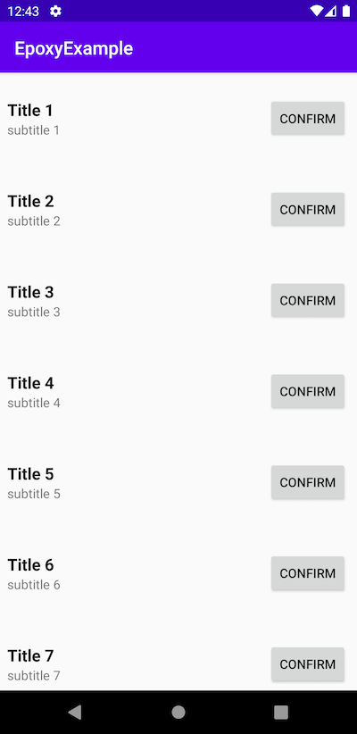

# Epoxy-DataBinding-Example

## 0. Introduction 

This repository shows how `Epoxy` library works with **Android Databinding,**

For more information, check [Epoxy library](https://github.com/airbnb/epoxy).

## 1. Set build.gradle

### 1-1. Add kapt

```
apply plugin: 'kotlin-kapt'

kapt {
  correctErrorTypes = true
}
```

### 1-2. Enable Databinding

```
android {
    ...
    // Databinding
    buildFeatures {
        dataBinding true
    }
}
```

### 1-3. Add Dependencies

```
  // Recycler View
  implementation 'androidx.recyclerview:recyclerview:1.1.0'

  // Data Binding
  kapt 'com.android.databinding:compiler:3.5.0'

  // epoxy
  kapt 'com.airbnb.android:epoxy-processor:4.1.0'
  implementation 'com.airbnb.android:epoxy:4.1.0'
  implementation 'com.airbnb.android:epoxy-databinding:4.1.0'
  annotationProcessor 'com.airbnb.android:epoxy-processor:4.1.0'
```
For now, [`4.1.0` is the latest version of Epoxy library.](https://github.com/airbnb/epoxy)


## 2. Set EpoxyDataBindingPatterns (or EpoxyConfig)

**⚠️ These file may be located on same pacakage with R.**

### 2-1. EpoxyDataBindingPattern
If names of resource files has some patterns, use [EpoxyDataBindingPatterns](https://github.com/HaenaraShin/Epoxy-DataBinding-Example/blob/master/app/src/main/java/dev/haenara/epoxyexample/EpoxyDataBindingPatterns.kt). 


```
package dev.haenara.epoxyexample

import com.airbnb.epoxy.EpoxyDataBindingPattern

@EpoxyDataBindingPattern(rClass = R::class, layoutPrefix = "item_")
object EpoxyDataBindingPatterns

```
If you use R2, use it instead of `R::class`

### 2-2. EpoxyConfig

If only specific files is used for epoxy, try [EpoxyConfig](https://github.com/HaenaraShin/Epoxy-DataBinding-Example/blob/master/app/src/main/java/dev/haenara/epoxyexample/EpoxyConfig.kt) instead.

```
package dev.haenara.epoxyexample

import com.airbnb.epoxy.EpoxyDataBindingLayouts
import com.airbnb.epoxy.PackageModelViewConfig

@PackageModelViewConfig(rClass = R::class)
@EpoxyDataBindingLayouts(R.layout.item_sample)
interface EpoxyConfig 
```
If you use R2, use it instead of `R::class`

## 3. Change RecyclerView to Epoxy's RecyclerView

Use RecyclerView from epoxy libaray instead of `Android Jetpack🚀`.

```
<com.airbnb.epoxy.EpoxyRecyclerView
        android:id="@+id/recycler_view"
        android:layout_width="match_parent"
        android:layout_height="match_parent" />
```

## 4. Make a model (layout resource with databinding)

Model files that inherits `EpoxyModel` would be generated automatically when you build your project👷.

Check this [sample file](https://github.com/HaenaraShin/Epoxy-DataBinding-Example/blob/master/app/src/main/res/layout/item_sample.xml).

```
<?xml version="1.0" encoding="utf-8"?>
<layout xmlns:android="http://schemas.android.com/apk/res/android"
    xmlns:app="http://schemas.android.com/apk/res-auto"
    xmlns:tools="http://schemas.android.com/tools">

    <data>

        <variable
            name="data"
            type="dev.haenara.epoxyexample.Data" />
        <variable
            name="onClick"
            type="android.view.View.OnClickListener" />

    </data>

    <androidx.constraintlayout.widget.ConstraintLayout
        android:layout_width="match_parent"
        android:layout_height="100dip">

        <TextView
            android:id="@+id/tv_title"
            android:layout_width="wrap_content"
            android:layout_height="wrap_content"
            android:layout_marginLeft="8dip"
            android:text="@{data.title}"
            android:textColor="#000000"
            android:textSize="18sp"
            android:textStyle="bold"
            app:layout_constraintBottom_toTopOf="@id/tv_subtitle"
            app:layout_constraintLeft_toLeftOf="parent"
            app:layout_constraintTop_toTopOf="parent"
            app:layout_constraintVertical_chainStyle="packed"
            tools:text="Title" />

        <TextView
            android:id="@+id/tv_subtitle"
            android:layout_width="wrap_content"
            android:layout_height="wrap_content"
            android:layout_marginLeft="8dip"
            android:text="@{data.subtitle}"
            app:layout_constraintBottom_toBottomOf="parent"
            app:layout_constraintLeft_toLeftOf="parent"
            app:layout_constraintTop_toBottomOf="@id/tv_title"
            app:layout_constraintVertical_chainStyle="packed"
            tools:text="Subtitle" />

        <Button
            android:id="@+id/btn"
            android:layout_width="wrap_content"
            android:layout_height="wrap_content"
            android:layout_marginRight="10dip"
            android:onClick="@{onClick}"
            android:text="Confirm"
            app:layout_constraintBottom_toBottomOf="parent"
            app:layout_constraintRight_toRightOf="parent"
            app:layout_constraintTop_toTopOf="parent" />

    </androidx.constraintlayout.widget.ConstraintLayout>
</layout>

```

Since this resource file's name is `item_sample.xml`, the generated file name would be `ItemSample`. 

Using EpoxyDataBindingPattern, the file name would start after prefix. For instance `Sample` when prefix is "item_".

> If a model file hasn't be generated, build or assemble once. 

> AndroidStudio 4.0.1 has a bug that it cannot follow renaming packages. In case of a trouble with model auto-generation, just restart AndroidStudio.

## 5. ViewHolder 

**🙅‍♂️ ViewHolder is not required, if you uses databinding.**

## 6. Make EpoxyController

### 6-1. Make a class inherits EpoxyContoller

```
class SampleController(val data: List<Data>) : EpoxyController() { }
```

Instead of `EpoxyController`, you may use `TypedEpoxyController` with generic. (or `Typed2EpoxyController`, ...)

### 6-2. Override buildModels function

```
    override fun buildModels() {
        data.forEachIndexed { index, data ->
            sample {
                id("sample$index")
                data(data)
                onClick { _ -> }
            }
        }
    }
```

Inside of `buildModels()`, you can put model on RecyclerView as just declaring model with simple closure.

Name of model (in this case `sample` is the model) is depends on layout resource name.

**⚠️⚠️⚠️ Don't forget to set id value on EpoxyModel ⚠️⚠️⚠️**

If you uses `TypedEpoxyController`, it has data on `buildModels()` and `setData()` must be called before `requestModelBuild()`.

## 7. Now, let magic happen

```
        recycler_view.setController(
            SampleController(
                listOfData() // Data Set
            )
        )
        recycler_view.requestModelBuild() // let magic happen
```

## 8. This is what happens




# LICNCE

```
MIT License

Copyright (c) 2020 Haenala Shin

Permission is hereby granted, free of charge, to any person obtaining a copy
of this software and associated documentation files (the "Software"), to deal
in the Software without restriction, including without limitation the rights
to use, copy, modify, merge, publish, distribute, sublicense, and/or sell
copies of the Software, and to permit persons to whom the Software is
furnished to do so, subject to the following conditions:

The above copyright notice and this permission notice shall be included in all
copies or substantial portions of the Software.

THE SOFTWARE IS PROVIDED "AS IS", WITHOUT WARRANTY OF ANY KIND, EXPRESS OR
IMPLIED, INCLUDING BUT NOT LIMITED TO THE WARRANTIES OF MERCHANTABILITY,
FITNESS FOR A PARTICULAR PURPOSE AND NONINFRINGEMENT. IN NO EVENT SHALL THE
AUTHORS OR COPYRIGHT HOLDERS BE LIABLE FOR ANY CLAIM, DAMAGES OR OTHER
LIABILITY, WHETHER IN AN ACTION OF CONTRACT, TORT OR OTHERWISE, ARISING FROM,
OUT OF OR IN CONNECTION WITH THE SOFTWARE OR THE USE OR OTHER DEALINGS IN THE
SOFTWARE.

```